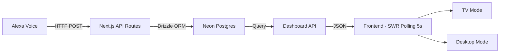
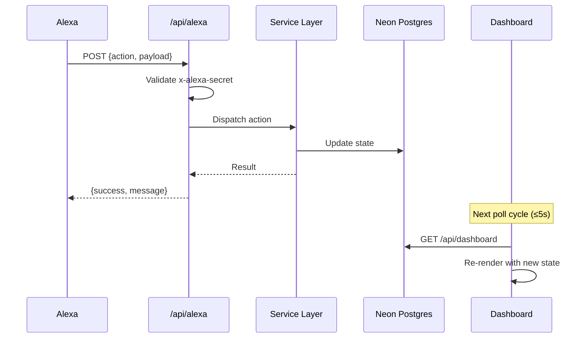
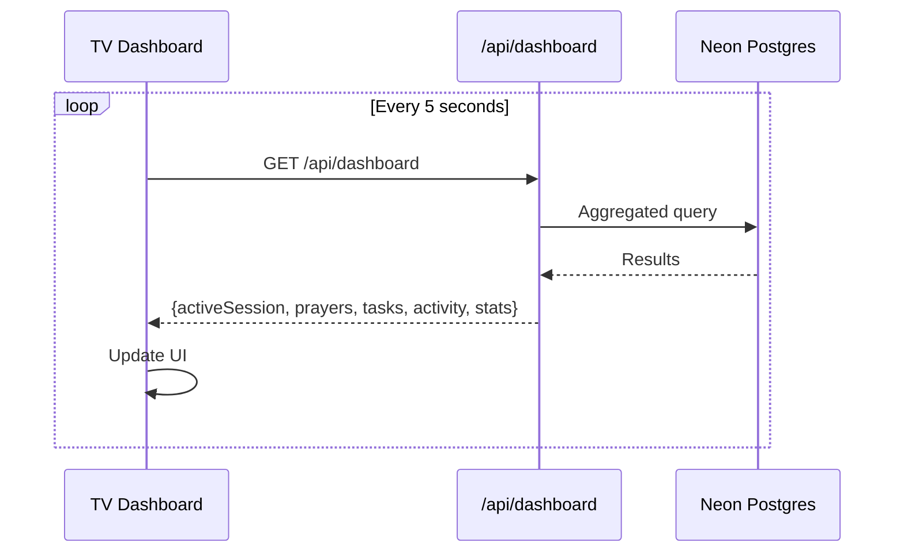
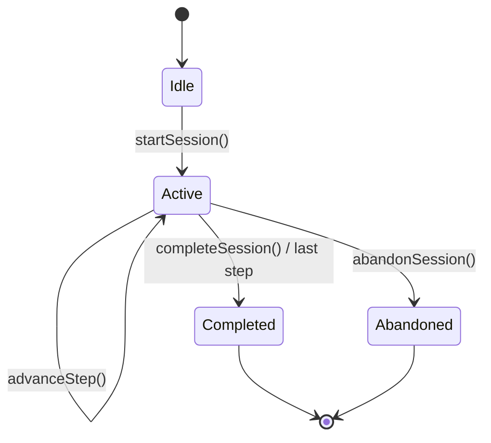
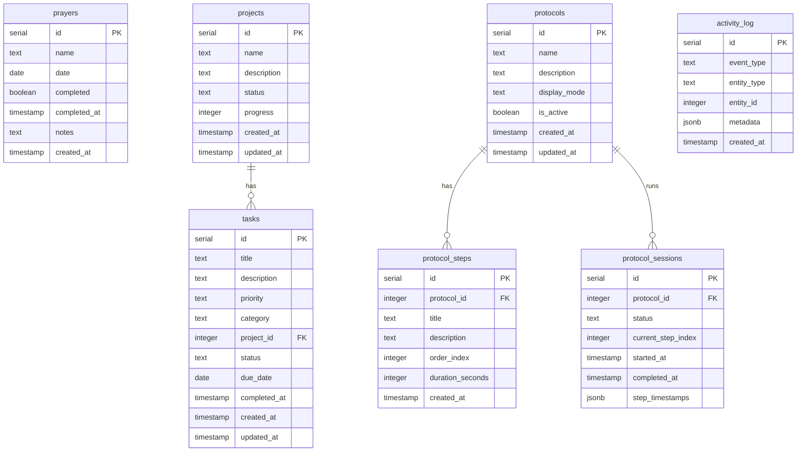

# Arkham — Architecture Document

## System Overview

Arkham follows a simple, linear architecture optimized for a single-user command center:



## Data Flow

### Voice Command Flow (Alexa → Dashboard)



### TV Mode Polling



## Component Breakdown

### Backend

| Component | Path | Purpose |
|-----------|------|---------|
| DB Client | `src/lib/db/index.ts` | Neon serverless + Drizzle singleton |
| Schema | `src/lib/db/schema.ts` | All table definitions |
| Services | `src/lib/services/*.ts` | Business logic (protocol, prayer, task, project, activity) |
| API Routes | `src/app/api/**` | Thin HTTP handlers |
| Alexa Auth | `src/lib/api/alexa-auth.ts` | Shared secret validation |

### Frontend

| Component | Path | Purpose |
|-----------|------|---------|
| TV Dashboard | `src/app/tv/page.tsx` | Fullscreen TV layout |
| Desktop Dashboard | `src/app/page.tsx` | Interactive control panel |
| TV Components | `src/components/tv/*` | Protocol card, prayer tracker, task summary, clock |
| Desktop Components | `src/components/desktop/*` | Full CRUD interfaces |
| Shared Components | `src/components/shared/*` | Card, button, badge, prayer-dot |
| Polling Hooks | `src/lib/hooks/*` | SWR hooks with 5s refresh |

## Protocol Engine Design

Protocols are the core abstraction in Arkham — structured, ordered sequences of steps.

### State Machine



### Data Model

- **Protocol**: Template (name, description, ordered steps)
- **Protocol Steps**: Ordered list belonging to a protocol
- **Protocol Session**: An active run of a protocol — tracks current step index and step timestamps
- **Constraint**: Only one session can be active at a time

## Database Structure



## TV Mode Behavior

### Layout

The TV mode uses a CSS Grid layout optimized for 1920x1080 viewing at distance:

```
+--------------------------------------------------+
|  ARKHAM                     [clock]    [date]     |
+--------------------------------------------------+
|                    |                              |
|   ACTIVE PROTOCOL  |      PRAYER STATUS           |
|   (large card)     |      + MISSION STATS          |
|                    |                              |
+--------------------+------------------------------+
|   TODAY'S TASKS    |      ACTIVITY FEED            |
+--------------------+------------------------------+
```

- No scrolling, no interactive elements
- Large typography (step names 4-6xl, prayers 2-3xl)
- High contrast dark theme
- Hidden cursor (`cursor-none`)

### Screen Detection Strategy

1. `/tv` route always renders TV mode
2. `/` route always renders desktop mode
3. `useDisplayMode()` hook detects viewport width >= 1920px and shows a suggestion toast
4. Manual toggle button available in both modes

## Deployment Model

- **Vercel** (recommended): Zero-config Next.js deployment
- **Neon Postgres**: Serverless database, connection via `DATABASE_URL`
- **Environment variables**: Set in Vercel dashboard or `.env` locally
- **TV Client**: Chromium kiosk mode on Fire TV Stick or similar device pointing at `/tv`
